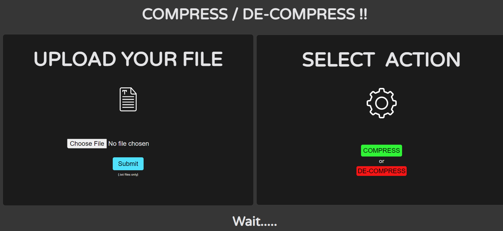
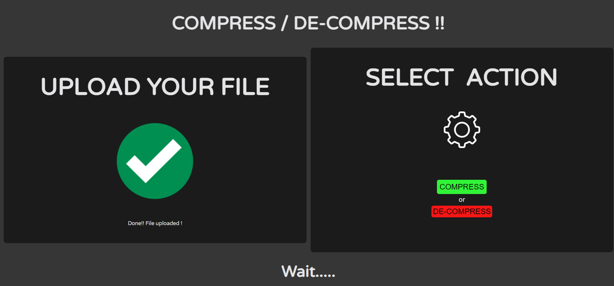
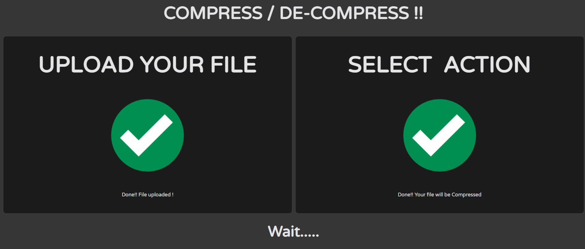
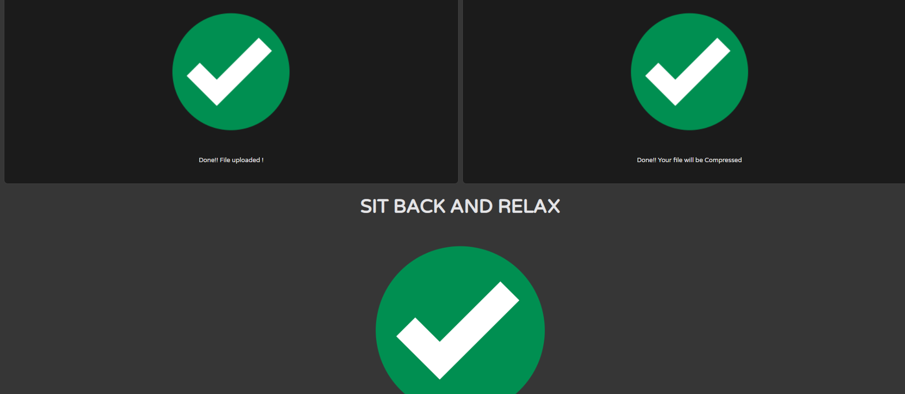
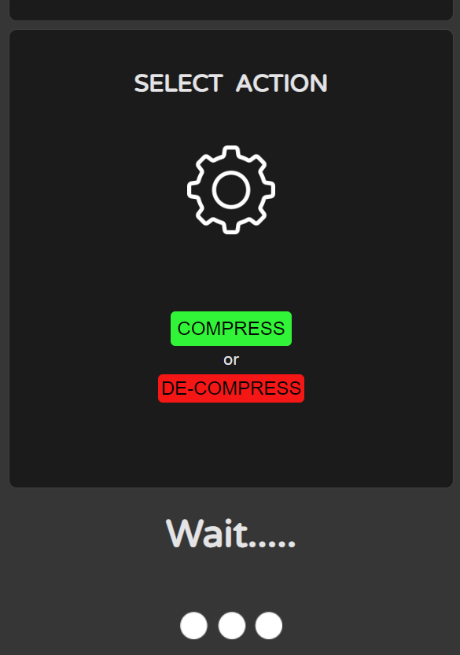
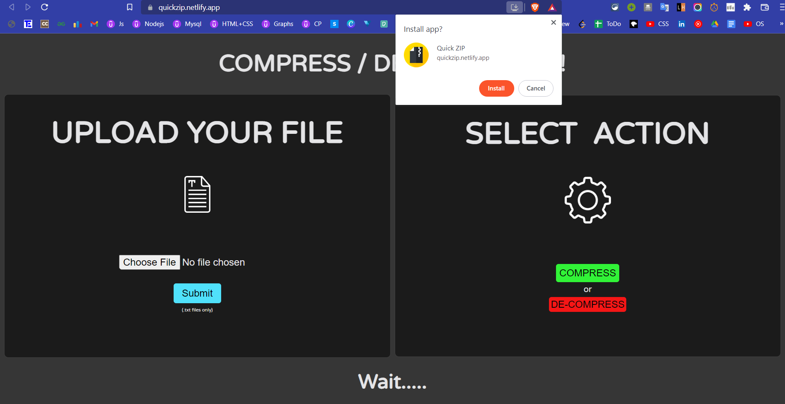

   
  
  
  

 

<h1> Quick Zip </h1>

This **webapp** compresses and decompresses **(.txt)** files in realtime.
 

## ⚙ About

- It compresses and decompresses .txt files using Huffman Coding technique .
- Huffman coding (also known as Huffman Encoding) is an algorithm for doing data compression, and it forms the basic idea behind file compression. This post talks about the fixed-length and variable-length encoding, uniquely decodable codes, prefix rules, and Huffman Tree construction.
- Compression ratio usually improves as the file size increases.
- WebApp is made responsive (with HTML and CSS ) and interactive (with JavaScript ) .
- It can also be downloaded locally as it is provided with feature of progressive web app.
- An Info page is added to give more information about Huffman coding.

 

## User Interface

- Initial Interface:

- Upload & Submit File

- Choose Action (**Compress / Decompress**)

- File Compressed and Ready to Download

- Responsive Capability a

- Responsive Capability b

- Ready to download PWA(Progressive Web App)

- Installable on Mobile

- Initial Window (Mobile)

